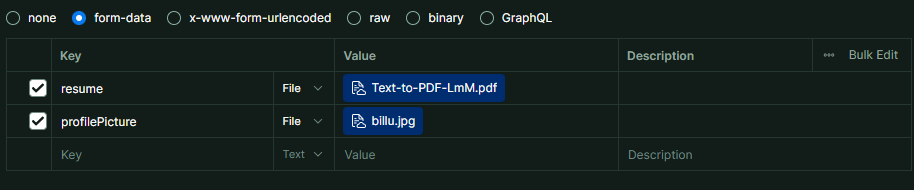

# DevConnect API

A comprehensive REST API for developer networking and profile management, built with Node.js and Express.js.

## 📋 Table of Contents

- [Overview](#overview)
- [Features](#features)
- [Getting Started](#getting-started)
- [API Endpoints](#api-endpoints)
  - [Authentication](#authentication)
  - [User Management](#user-management)
  - [Utility Services](#utility-services)
- [Request/Response Examples](#requestresponse-examples)
- [Error Handling](#error-handling)
- [Contributing](#contributing)

## 🚀 Overview

DevConnect API provides a robust backend solution for developer networking platforms. It offers secure authentication, comprehensive user profile management, and utility services like OTP verification for password recovery.

## ✨ Features

- **Secure Authentication**: JWT-based login/logout system
- **Comprehensive User Profiles**: Support for skills, education, experience, certifications
- **File Upload Support**: Profile pictures and resume uploads
- **Password Management**: Reset and recovery functionality with OTP verification
- **Social Integration**: LinkedIn and GitHub profile linking
- **RESTful Architecture**: Clean, predictable API design

## 🛠 Getting Started

### Prerequisites

- Node.js (v14 or higher)
- MongoDB
- npm or yarn

### Base URL

```
http://localhost:3000/devconnect
```

## 📡 API Endpoints

### Authentication

#### Sign Up

Create a new user account.

```http
POST /auth/sign-up
```

**Required Fields:** `email`, `name`, `password`, `mobile`

#### Login

Authenticate an existing user.

```http
POST /auth/login
```

**Required Fields:** `email`, `password`

#### Logout

Terminate the current user session.

```http
POST /auth/logout
```

**Authentication:** Required

---

### User Management

#### Delete User Account

Permanently delete a user account.

```http
DELETE /user/delete
```

**Required Fields:** `email`, `password`

#### Reset Password

Change password for authenticated users.

```http
PATCH /user/reset-password
```

**Required Fields:** `oldpassword`, `newpassword`
**Authentication:** Required

#### Set New Password (Forgot Password)

Set a new password using reset token from OTP verification.

```http
PATCH /user/set-new-password
```

**Required Fields:** `resetToken`, `newPassword`

#### Update User Profile

Update user profile information and upload files.

```http
PATCH /user/update-user
```

**Authentication:** Required
**Content-Type:** `multipart/form-data` (for file uploads) or `application/json`



**Optional Fields:**

- `name` - Full name
- `mobile` - Phone number with country code
- `bio` - Professional bio
- `dob` - Date of birth
- `designation` - Job title
- `profilePicture` - Profile image file
- `location` - Address information
- `socialLinks` - GitHub, LinkedIn profiles
- `skills` - Technical skills array
- `education` - Educational background
- `experience` - Work experience
- `resume` - Resume file upload
- `certification` - Professional certifications

---

### Utility Services

#### Send OTP

Send verification code to user's email for password recovery.

```http
POST /otp/send-otp
```

**Required Fields:** `email`

#### Verify OTP

Verify the OTP and receive reset token.

```http
POST /otp/verify-otp
```

**Required Fields:** `email`, `otp`

## 📝 Complete API Request/Response Examples

### Authentication Endpoints

#### Sign Up

**Request:**

```json
{
  "email": "kartikwork@gmail.com",
  "name": "Kartik Bhatt",
  "password": "Kartik@12345",
  "mobile": "9310204975"
}
```

**Response:**

```json
{
  "responseCode": 201,
  "status": "success",
  "message": "Kartik Bhatt User created Successfully",
  "data": {
    "email": "kartikwork@gmail.com",
    "password": "$2b$10$p/1iXs7UZk5NAQHwsw/Ev.WU8wGfMieOU7QcqVIvjB65Vf6pc7Y4i",
    "name": "Kartik Bhatt"
  }
}
```

#### Login

**Request:**

```json
{
  "email": "kartikwork@gmail.com",
  "password": "Kartik@12345"
}
```

**Response:**

```json
{
  "responseCode": 201,
  "status": "success",
  "message": "Kartik Bhatt user logged in successfully",
  "data": {
    "_id": "68ba9038aeeb2a6467e6be76",
    "name": "Kartik Bhatt",
    "email": "kartikwork@gmail.com"
  }
}
```

#### Logout

**Request:** No request body required

**Response:**

```json
{
  "responseCode": 201,
  "status": "success",
  "message": "user logged out successfully"
}
```

### User Management Endpoints

#### Delete User

**Request:**

```json
{
  "email": "kartikwork@gmail.com",
  "password": "Kartik@12345"
}
```

**Response:**

```json
{
  "responseCode": 201,
  "status": "success",
  "message": "Kartik Bhatt user deleted successfully"
}
```

#### Reset Password

**Request:**

```json
{
  "oldpassword": "Kartik@12345",
  "newpassword": "Raj@1234567new"
}
```

**Response:**

```json
{
  "responseCode": 201,
  "status": "success",
  "message": "Kartik Bhatt user password updated successfully"
}
```

#### Set New Password (Forgot Password)

**Request:**

```json
{
  "resetToken": "852074e5c5e70bc364cf2e3ae244ce0e88da4133de1afffd10430f66151d7c6d",
  "newPassword": "Mayank@123"
}
```

**Response:**

```json
{
  "responseCode": 201,
  "status": "success",
  "message": "Kartik Bhatt user password reseted successfully"
}
```

#### Update User Profile

**Request:**

```json
{
  "name": "Kartikey Bhatt",
  "mobile": {
    "countryCode": "+91",
    "number": "9123456789"
  },
  "bio": "Backend developer passionate about building scalable APIs ⚡",
  "dob": "2003-05-06T00:00:00.000Z",
  "designation": "Backend Engineer",
  "location": {
    "country": "India",
    "state": "Uttarakhand",
    "city": "Dehradun",
    "address": "45 IT Park Road"
  },
  "socialLinks": [
    {
      "platform": "GitHub",
      "url": "https://github.com/kartikeybhatt"
    },
    {
      "platform": "LinkedIn",
      "url": "https://linkedin.com/in/kartikeybhatt"
    }
  ],
  "skills": ["Node.js", "Express.js", "MongoDB", "Docker", "Kubernetes"],
  "education": [
    {
      "degree": "B.Sc Computer Science",
      "institution": "Delhi University",
      "startDate": "2020-08-01T00:00:00.000Z",
      "endDate": "2023-05-01T00:00:00.000Z"
    }
  ],
  "experience": [
    {
      "position": "Backend Developer Intern",
      "company": "TechNova Solutions",
      "startDate": "2023-06-01T00:00:00.000Z",
      "endDate": "2024-03-01T00:00:00.000Z",
      "description": "Worked on REST APIs, authentication, and containerized services using Docker."
    }
  ],
  "certification": [
    {
      "company": "Google",
      "certificate": "Google Cloud Associate Engineer",
      "issuedBy": "Google",
      "issueDate": "2022-07-15T00:00:00.000Z"
    },
    {
      "company": "Linux Foundation",
      "certificate": "Certified Kubernetes Administrator (CKA)",
      "issuedBy": "CNCF",
      "issueDate": "2024-02-20T00:00:00.000Z"
    }
  ]
}
```

**Response:**

```json
{
  "responseCode": 201,
  "status": "success",
  "message": "Kartikey Bhatt user updated successfully",
  "data": {
    "mobile": {
      "countryCode": "+91",
      "number": "9123456789"
    },
    "location": {
      "country": "India",
      "state": "Uttarakhand",
      "city": "Dehradun",
      "address": "45 IT Park Road"
    },
    "_id": "68bb294a15f5f4ef346dce71",
    "email": "kartikwork@gmail.com",
    "password": "$2b$10$1XaoEp/AUVc3VznriDTB..JaTsKhk8hryCuAJUtRTeYP/T64KPgCm",
    "name": "Kartikey Bhatt",
    "bio": "Backend developer passionate about building scalable APIs ⚡",
    "skills": ["Node.js", "Express.js", "MongoDB", "Docker", "Kubernetes"],
    "role": "user",
    "education": [
      {
        "degree": "B.Sc Computer Science",
        "institution": "Delhi University",
        "startDate": "2020-08-01T00:00:00.000Z",
        "endDate": "2023-05-01T00:00:00.000Z"
      }
    ],
    "experience": [
      {
        "position": "Backend Developer Intern",
        "company": "TechNova Solutions",
        "startDate": "2023-06-01T00:00:00.000Z",
        "endDate": "2024-03-01T00:00:00.000Z",
        "description": "Worked on REST APIs, authentication, and containerized services using Docker."
      }
    ],
    "certification": [
      {
        "company": "Google",
        "certificate": "Google Cloud Associate Engineer",
        "issuedBy": "Google",
        "issueDate": "2022-07-15T00:00:00.000Z"
      },
      {
        "company": "Linux Foundation",
        "certificate": "Certified Kubernetes Administrator (CKA)",
        "issuedBy": "CNCF",
        "issueDate": "2024-02-20T00:00:00.000Z"
      }
    ],
    "socialLinks": [
      {
        "platform": "GitHub",
        "url": "https://github.com/kartikeybhatt"
      },
      {
        "platform": "LinkedIn",
        "url": "https://linkedin.com/in/kartikeybhatt"
      }
    ],
    "createdAt": "2025-09-05T18:17:46.017Z",
    "updatedAt": "2025-09-05T18:19:10.630Z",
    "__v": 0,
    "age": 22,
    "designation": "Backend Engineer",
    "dob": "2003-05-06T00:00:00.000Z",
    "profilePicture": "DevConnect-user-profilePicture.68bb294a15f5f4ef346dce71.jpg",
    "resume": "DevConnect-user-resume.68bb294a15f5f4ef346dce71.pdf"
  }
}
```

### Utility Service Endpoints

#### Send OTP

**Request:**

```json
{
  "email": "kartikwork@gmail.com"
}
```

**Response:**

```json
{
  "responseCode": "200",
  "status": "success",
  "message": "OTP sent successfully to kartikwork@gmail.com"
}
```

#### Verify OTP

**Request:**

```json
{
  "email": "kartikwork@gmail.com",
  "otp": "919246"
}
```

**Response:**

```json
{
  "status": 200,
  "message": "OTP verified successfully. Use the provided token to set a new password.",
  "data": {
    "token": "4a62cfb1dcce6447c75fd810d6314b4ec620d392cc3353f21263479a347bd2d8",
    "contact": "kartikwork@gmail.com"
  }
}
```

## ⚠️ Error Handling

The API returns consistent error responses with appropriate HTTP status codes:

```json
{
  "responseCode": 400,
  "status": "error",
  "message": "Validation error: Email is required"
}
```

Common status codes:

- `200` - Success
- `201` - Created
- `400` - Bad Request
- `401` - Unauthorized
- `404` - Not Found
- `500` - Internal Server Error

## 🔐 Authentication

Most endpoints require authentication. Include the JWT token in your requests:

```http
Authorization: Bearer <your-jwt-token>
```

## 📁 File Uploads

For profile pictures and resume uploads, use `multipart/form-data`:

```javascript
const formData = new FormData();
formData.append("profilePicture", file);
formData.append("name", "John Doe");
```

## 🤝 Contributing

1. Fork the repository
2. Create a feature branch: `git checkout -b feature/new-feature`
3. Commit your changes: `git commit -m 'Add new feature'`
4. Push to the branch: `git push origin feature/new-feature`
5. Submit a pull request

## 📄 License

This project is licensed under the MIT License - see the [LICENSE](LICENSE) file for details.

## 📞 Support

For support and questions, please open an issue in the GitHub repository or contact the development team.

---

**Built with ❤️ for the developer community**
