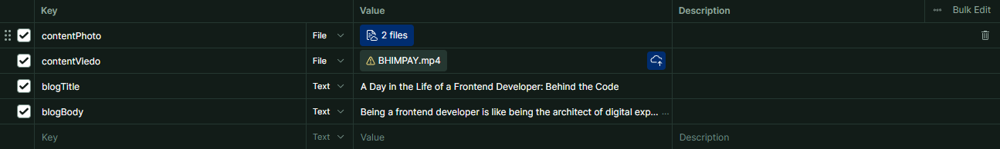

# DevConnect API

A comprehensive REST API for developer networking and profile management, built with Node.js and Express.js.

## 📋 Table of Contents

- [Overview](#overview)
- [Features](#features)
- [Getting Started](#getting-started)
- [API Endpoints](#api-endpoints)
  - [Authentication](#authentication)
  - [User Management](#user-management)
  - [Blog Management](#blog-management)
  - [Utility Services](#utility-services)
- [Request/Response Examples](#requestresponse-examples)
- [Error Handling](#error-handling)
- [Contributing](#contributing)

## 🚀 Overview

DevConnect API provides a robust backend solution for developer networking platforms. It offers secure authentication, comprehensive user profile management, blog posting capabilities, and utility services like OTP verification for password recovery.

## ✨ Features

- **Secure Authentication**: JWT-based login/logout system
- **Comprehensive User Profiles**: Support for skills, education, experience, certifications
- **Blog Management**: Create, read, update, and delete blog posts with reactions
- **File Upload Support**: Profile pictures, resume, and blog media uploads
- **Password Management**: Reset and recovery functionality with OTP verification
- **Social Integration**: LinkedIn and GitHub profile linking
- **RESTful Architecture**: Clean, predictable API design

## 🛠 Getting Started

### Prerequisites

- Node.js (v14 or higher)
- MongoDB
- npm or yarn

### Base URL

```
http://localhost:3000/devconnect
```

## 📡 API Endpoints

### Authentication

#### Sign Up

Create a new user account.

```http
POST /auth/sign-up
```

**Required Fields:** `email`, `name`, `password`, `mobile`

#### Login

Authenticate an existing user.

```http
POST /auth/login
```

**Required Fields:** `email`, `password`

#### Logout

Terminate the current user session.

```http
POST /auth/logout
```

**Authentication:** Required

---

### User Management

#### Delete User Account

Permanently delete a user account.

```http
DELETE /user/delete
```

**Required Fields:** `email`, `password`

#### Reset Password

Change password for authenticated users.

```http
PATCH /user/reset-password
```

**Required Fields:** `oldpassword`, `newpassword`
**Authentication:** Required

#### Set New Password (Forgot Password)

Set a new password using reset token from OTP verification.

```http
PATCH /user/set-new-password
```

**Required Fields:** `resetToken`, `newPassword`

#### Update User Profile

Update user profile information and upload files.

```http
PATCH /user/update-user
```

**Authentication:** Required
**Content-Type:** `multipart/form-data` (for file uploads) or `application/json`


**Optional Fields:**

- `name` - Full name
- `mobile` - Phone number with country code
- `bio` - Professional bio
- `dob` - Date of birth
- `designation` - Job title
- `profilePicture` - Profile image file
- `location` - Address information
- `socialLinks` - GitHub, LinkedIn profiles
- `skills` - Technical skills array
- `education` - Educational background
- `experience` - Work experience
- `resume` - Resume file upload
- `certification` - Professional certifications

---

### Blog Management

#### Create Blog

Create a new blog post with optional media uploads.

```http
POST /blog/create-blog
```

**Authentication:** Required
**Content-Type:** `multipart/form-data`

**Required Fields:** `blogTitle`, `blogBody`
**Optional Fields:** `blogPhoto` (multiple files), `blogVideo` (multiple files)


#### List User Blogs

Retrieve all blog posts created by the authenticated user.

```http
GET /blog/list-user-blogs
```

**Authentication:** Required

#### List All Blogs

Retrieve all blog posts from all users.

```http
GET /blog/list-all-blogs
```

**Authentication:** Required

#### Edit Blog

Update an existing blog post.

```http
PATCH /blog/edit-blog
```

**Authentication:** Required

**Required Fields:** `blogId`
**Optional Fields:** `blogTitle`, `blogBody`, `blogPhoto`, `blogVideo`

#### Delete Blog

Delete a blog post.

```http
PATCH /blog/delete-blog
```

**Authentication:** Required

**Required Fields:** `blogId`

#### React to Blog

Add or update reaction (agree/disagree) to a blog post.

```http
PUT /blog/react-blog
```

**Authentication:** Required

**Required Fields:** `blogId`, `reaction` (values: `agree` or `disagree`)

---

### Utility Services

#### Send OTP

Send verification code to user's email for password recovery.

```http
POST /otp/send-otp
```

**Required Fields:** `email`

#### Verify OTP

Verify the OTP and receive reset token.

```http
POST /otp/verify-otp
```

**Required Fields:** `email`, `otp`

## 📝 Complete API Request/Response Examples

### Authentication Endpoints

#### Sign Up

**Request:**

```json
{
  "email": "kartikwork@gmail.com",
  "name": "Kartik Bhatt",
  "password": "Kartik@12345",
  "mobile": "9310204975"
}
```

**Response:**

```json
{
  "responseCode": 201,
  "status": "success",
  "message": "Kartik Bhatt User created Successfully",
  "data": {
    "email": "kartikwork@gmail.com",
    "password": "$2b$10$p/1iXs7UZk5NAQHwsw/Ev.WU8wGfMieOU7QcqVIvjB65Vf6pc7Y4i",
    "name": "Kartik Bhatt"
  }
}
```

#### Login

**Request:**

```json
{
  "email": "kartikwork@gmail.com",
  "password": "Kartik@12345"
}
```

**Response:**

```json
{
  "responseCode": 201,
  "status": "success",
  "message": "Kartik Bhatt user logged in successfully",
  "data": {
    "_id": "68ba9038aeeb2a6467e6be76",
    "name": "Kartik Bhatt",
    "email": "kartikwork@gmail.com"
  }
}
```

#### Logout

**Request:** No request body required

**Response:**

```json
{
  "responseCode": 201,
  "status": "success",
  "message": "user logged out successfully"
}
```

### User Management Endpoints

#### Delete User

**Request:**

```json
{
  "email": "kartikwork@gmail.com",
  "password": "Kartik@12345"
}
```

**Response:**

```json
{
  "responseCode": 201,
  "status": "success",
  "message": "Kartik Bhatt user deleted successfully"
}
```

#### Reset Password

**Request:**

```json
{
  "oldpassword": "Kartik@12345",
  "newpassword": "Raj@1234567new"
}
```

**Response:**

```json
{
  "responseCode": 201,
  "status": "success",
  "message": "Kartik Bhatt user password updated successfully"
}
```

#### Set New Password (Forgot Password)

**Request:**

```json
{
  "resetToken": "852074e5c5e70bc364cf2e3ae244ce0e88da4133de1afffd10430f66151d7c6d",
  "newPassword": "Mayank@123"
}
```

**Response:**

```json
{
  "responseCode": 201,
  "status": "success",
  "message": "Kartik Bhatt user password reseted successfully"
}
```

#### Update User Profile

**Request:**

```json
{
  "name": "Kartikey Bhatt",
  "mobile": {
    "countryCode": "+91",
    "number": "9123456789"
  },
  "bio": "Backend developer passionate about building scalable APIs ⚡",
  "dob": "2003-05-06T00:00:00.000Z",
  "designation": "Backend Engineer",
  "location": {
    "country": "India",
    "state": "Uttarakhand",
    "city": "Dehradun",
    "address": "45 IT Park Road"
  },
  "socialLinks": [
    {
      "platform": "GitHub",
      "url": "https://github.com/kartikeybhatt"
    },
    {
      "platform": "LinkedIn",
      "url": "https://linkedin.com/in/kartikeybhatt"
    }
  ],
  "skills": ["Node.js", "Express.js", "MongoDB", "Docker", "Kubernetes"],
  "education": [
    {
      "degree": "B.Sc Computer Science",
      "institution": "Delhi University",
      "startDate": "2020-08-01T00:00:00.000Z",
      "endDate": "2023-05-01T00:00:00.000Z"
    }
  ],
  "experience": [
    {
      "position": "Backend Developer Intern",
      "company": "TechNova Solutions",
      "startDate": "2023-06-01T00:00:00.000Z",
      "endDate": "2024-03-01T00:00:00.000Z",
      "description": "Worked on REST APIs, authentication, and containerized services using Docker."
    }
  ],
  "certification": [
    {
      "company": "Google",
      "certificate": "Google Cloud Associate Engineer",
      "issuedBy": "Google",
      "issueDate": "2022-07-15T00:00:00.000Z"
    },
    {
      "company": "Linux Foundation",
      "certificate": "Certified Kubernetes Administrator (CKA)",
      "issuedBy": "CNCF",
      "issueDate": "2024-02-20T00:00:00.000Z"
    }
  ]
}
```

**Response:**

```json
{
  "responseCode": 201,
  "status": "success",
  "message": "Kartikey Bhatt user updated successfully",
  "data": {
    "mobile": {
      "countryCode": "+91",
      "number": "9123456789"
    },
    "location": {
      "country": "India",
      "state": "Uttarakhand",
      "city": "Dehradun",
      "address": "45 IT Park Road"
    },
    "_id": "68bb294a15f5f4ef346dce71",
    "email": "kartikwork@gmail.com",
    "password": "$2b$10$1XaoEp/AUVc3VznriDTB..JaTsKhk8hryCuAJUtRTeYP/T64KPgCm",
    "name": "Kartikey Bhatt",
    "bio": "Backend developer passionate about building scalable APIs ⚡",
    "skills": ["Node.js", "Express.js", "MongoDB", "Docker", "Kubernetes"],
    "role": "user",
    "education": [
      {
        "degree": "B.Sc Computer Science",
        "institution": "Delhi University",
        "startDate": "2020-08-01T00:00:00.000Z",
        "endDate": "2023-05-01T00:00:00.000Z"
      }
    ],
    "experience": [
      {
        "position": "Backend Developer Intern",
        "company": "TechNova Solutions",
        "startDate": "2023-06-01T00:00:00.000Z",
        "endDate": "2024-03-01T00:00:00.000Z",
        "description": "Worked on REST APIs, authentication, and containerized services using Docker."
      }
    ],
    "certification": [
      {
        "company": "Google",
        "certificate": "Google Cloud Associate Engineer",
        "issuedBy": "Google",
        "issueDate": "2022-07-15T00:00:00.000Z"
      },
      {
        "company": "Linux Foundation",
        "certificate": "Certified Kubernetes Administrator (CKA)",
        "issuedBy": "CNCF",
        "issueDate": "2024-02-20T00:00:00.000Z"
      }
    ],
    "socialLinks": [
      {
        "platform": "GitHub",
        "url": "https://github.com/kartikeybhatt"
      },
      {
        "platform": "LinkedIn",
        "url": "https://linkedin.com/in/kartikeybhatt"
      }
    ],
    "createdAt": "2025-09-05T18:17:46.017Z",
    "updatedAt": "2025-09-05T18:19:10.630Z",
    "__v": 0,
    "age": 22,
    "designation": "Backend Engineer",
    "dob": "2003-05-06T00:00:00.000Z",
    "profilePicture": "DevConnect-user-profilePicture.68bb294a15f5f4ef346dce71.jpg",
    "resume": "DevConnect-user-resume.68bb294a15f5f4ef346dce71.pdf"
  }
}
```

### Blog Management Endpoints

#### Create Blog

**Request:**


**Response:**

```json
{
  "responseCode": 201,
  "status": "success",
  "message": "Mayank Kansal user blog posted successfully",
  "data": {
    "reactions": {
      "agreed": [],
      "disagreed": []
    },
    "userId": {
      "_id": "68ba952eb7d1f98aa65dd0e5",
      "name": "Mayank Kansal"
    },
    "blogTitle": "A Day in the Life of a Frontend Developer: Behind the Code",
    "blogBody": "Being a frontend developer is like being the architect of digital experiences. While the backend powers everything behind the scenes, frontend developers bring ideas to life in ways users can see, touch, and interact with.\n\nMy typical day starts with a cup of coffee and reviewing the UI tasks or bug reports from the previous day. I check design updates, sync with the team on priorities, and dive into building or refining user interfaces. A large part of the day is spent writing clean, responsive code, integrating APIs, and ensuring that the design matches perfectly with the vision.\n\nCollaboration is key. I work closely with designers to translate mockups into functional components and coordinate with backend developers to make sure data flows seamlessly. Debugging layout issues, optimizing for performance, and testing across browsers and devices are everyday challenges that keep me sharp.\n\nThe day often ends with polishing small details, pushing updates for review, and documenting changes for the team. Being a frontend developer isn't just about coding; it's about shaping intuitive and engaging experiences that make the digital world enjoyable for users.",
    "blogPhoto": [
      "contentPhoto-1760548789757-68ba952eb7d1f98aa65dd0e5.jpg",
      "contentPhoto-1760548789758-68ba952eb7d1f98aa65dd0e5.png"
    ],
    "blogViedo": [],
    "createdAt": "2025-10-15T17:19:49.813Z",
    "__v": 0
  }
}
```

#### List User Blogs

**Request:** No request body required

**Response:**

```json
{
  "responseCode": 201,
  "status": "success",
  "message": "Mayank Kansal user blogs displayed successfully",
  "data": [
    {
      "reactions": {
        "agreed": [],
        "disagreed": []
      },
      "userId": "68ba952eb7d1f98aa65dd0e5",
      "blogTitle": "My Minimalist WFH Setup for Productivity",
      "blogBody": "Sharing a quick look at my current work-from-home setup! I try to keep things minimal to stay focused.\r\n\r\nMy essentials are my ultrawide monitor for multitasking, a mechanical keyboard (the clicky sounds are so satisfying!), and a good ergonomic chair. Keeping my desk clear of clutter has been a huge productivity booster.\r\n\r\nWhat's one piece of gear you can't live without in your setup?",
      "blogPhoto": ["contentPhoto-1760529675414-68ba952eb7d1f98aa65dd0e5.jpg"],
      "blogViedo": [],
      "createdAt": "2025-10-15T12:01:15.442Z"
    }
  ]
}
```

#### List All Blogs

**Request:** No request body required

**Response:**

```json
{
  "responseCode": 201,
  "status": "success",
  "message": "All user blogs displayed successfully",
  "data": [
    {
      "reactions": {
        "agreed": [],
        "disagreed": []
      },
      "userId": {
        "_id": "68dcc1d5adbd3a709ba327d1",
        "name": "Krrish Rana",
        "designation": "User"
      },
      "blogTitle": "Today I Learned: The Power of CSS Grid",
      "blogBody": "I've always used Flexbox for layouts, but today I finally dove into CSS Grid and I'm amazed!\r\n\r\nThe ability to control both columns and rows makes complex layouts so much more intuitive. The `grid-template-areas` property feels like a superpower for organizing a page. I don't think I'll ever build a main page layout without it again.\r\n\r\nDefinitely a game-changer for my workflow.",
      "blogPhoto": [
        "contentPhoto-1760528974693-68dcc1d5adbd3a709ba327d1.png",
        "contentPhoto-1760528974693-68dcc1d5adbd3a709ba327d1.png"
      ],
      "blogViedo": [],
      "createdAt": "2025-10-15T11:49:34.720Z"
    },
    {
      "reactions": {
        "agreed": [],
        "disagreed": []
      },
      "userId": {
        "_id": "68ba952eb7d1f98aa65dd0e5",
        "name": "Mayank Kansal",
        "designation": "Full Stack Web Developer"
      },
      "blogTitle": "My Minimalist WFH Setup for Productivity",
      "blogBody": "Sharing a quick look at my current work-from-home setup! I try to keep things minimal to stay focused.\r\n\r\nMy essentials are my ultrawide monitor for multitasking, a mechanical keyboard (the clicky sounds are so satisfying!), and a good ergonomic chair. Keeping my desk clear of clutter has been a huge productivity booster.\r\n\r\nWhat's one piece of gear you can't live without in your setup?",
      "blogPhoto": ["contentPhoto-1760529675414-68ba952eb7d1f98aa65dd0e5.jpg"],
      "blogViedo": [],
      "createdAt": "2025-10-15T12:01:15.442Z"
    },
    {
      "reactions": {
        "agreed": [],
        "disagreed": []
      },
      "userId": {
        "_id": "68ef94fc3934c31ad9a063aa",
        "name": "Rahul Rana",
        "designation": "Graphic Designer"
      },
      "blogTitle": "Craving Summer: Illustrating a Refreshing Mango Shake",
      "blogBody": "With summer just around the corner (or maybe I'm just dreaming of it!), I wanted to bring some vibrant, tropical energy into my latest illustration: a delicious mango shake!\r\n\r\nThis project was all about capturing that perfect blend of creaminess, sweetness, and a hint of tang. My focus was on:\r\n\r\n1.  **Color Palette:** How to make those golden mango hues pop, contrasting with the frosty glass and a touch of fresh mint.\r\n2.  **Texture Play:** Using subtle brushes and blending modes to suggest the thick, smooth texture of the shake and the condensation on the glass.\r\n3.  **Composition:** Arranging the elements – the shake, a few mango slices, and a straw – to create an inviting and dynamic visual.\r\n\r\nIt's amazing how much detail goes into making a simple drink look irresistible! What's your go-to summer treat, and how would you illustrate it?",
      "blogPhoto": ["contentPhoto-1760532843981-68ef94fc3934c31ad9a063aa.jpeg"],
      "blogViedo": [],
      "createdAt": "2025-10-15T12:54:04.013Z"
    }
  ]
}
```

#### Edit Blog

**Request:**

```json
{
  "blogId": "68ef8d0b3934c31ad9a0637d",
  "blogTitle": "updated api working fine for blog 2",
  "blogBody": "updated api has updated user content 2"
}
```

**Response:**

```json
{
  "responseCode": 200,
  "status": "success",
  "message": "Mayank Kansal's blog updated successfully",
  "data": {
    "reactions": {
      "agreed": [],
      "disagreed": []
    },
    "_id": "68ef8d0b3934c31ad9a0637d",
    "userId": "68ba952eb7d1f98aa65dd0e5",
    "blogTitle": "updated api working fine for blog 2",
    "blogBody": "updated api has updated user content 2",
    "blogPhoto": ["contentPhoto-1760529675414-68ba952eb7d1f98aa65dd0e5.jpg"],
    "blogViedo": [],
    "createdAt": "2025-10-15T12:01:15.442Z",
    "updatedAt": "2025-10-15T17:15:47.837Z",
    "__v": 0
  }
}
```

#### Delete Blog

**Request:**

```json
{
  "blogId": "68ef8d0b3934c31ad9a0637d"
}
```

**Response:**

```json
{
  "responseCode": 200,
  "status": "success",
  "message": "Mayank Kansal's blog deleted successfully",
  "data": {
    "reactions": {
      "agreed": [],
      "disagreed": []
    },
    "_id": "68ef8d0b3934c31ad9a0637d",
    "userId": "68ba952eb7d1f98aa65dd0e5",
    "blogTitle": "updated api working fine for blog 2",
    "blogBody": "updated api has updated user content 2",
    "blogPhoto": ["contentPhoto-1760529675414-68ba952eb7d1f98aa65dd0e5.jpg"],
    "blogViedo": [],
    "createdAt": "2025-10-15T12:01:15.442Z",
    "updatedAt": "2025-10-15T17:15:47.837Z",
    "__v": 0
  }
}
```

#### React to Blog

**Request:**

```json
{
  "blogId": "68ef8a4e3934c31ad9a06326",
  "reaction": "agree"
}
```

**Response:**

```json
{
  "responseCode": 200,
  "status": "success",
  "message": "Mayank Kansal reacted with agree",
  "data": {
    "postId": "68ef8a4e3934c31ad9a06326",
    "agreedCount": 1,
    "disagreedCount": 0,
    "agreed": [
      {
        "_id": "68ba952eb7d1f98aa65dd0e5",
        "name": "Mayank Kansal"
      }
    ],
    "disagreed": []
  }
}
```

### Utility Service Endpoints

#### Send OTP

**Request:**

```json
{
  "email": "kartikwork@gmail.com"
}
```

**Response:**

```json
{
  "responseCode": "200",
  "status": "success",
  "message": "OTP sent successfully to kartikwork@gmail.com"
}
```

#### Verify OTP

**Request:**

```json
{
  "email": "kartikwork@gmail.com",
  "otp": "919246"
}
```

**Response:**

```json
{
  "status": 200,
  "message": "OTP verified successfully. Use the provided token to set a new password.",
  "data": {
    "token": "4a62cfb1dcce6447c75fd810d6314b4ec620d392cc3353f21263479a347bd2d8",
    "contact": "kartikwork@gmail.com"
  }
}
```

## ⚠️ Error Handling

The API returns consistent error responses with appropriate HTTP status codes:

```json
{
  "responseCode": 400,
  "status": "error",
  "message": "Validation error: Email is required"
}
```

Common status codes:

- `200` - Success
- `201` - Created
- `400` - Bad Request
- `401` - Unauthorized
- `404` - Not Found
- `500` - Internal Server Error

## 🔐 Authentication

Most endpoints require authentication. Include the JWT token in your requests:

```http
Authorization: Bearer <your-jwt-token>
```

## 📁 File Uploads

For profile pictures, resume, and blog media uploads, use `multipart/form-data`:

```javascript
const formData = new FormData();
formData.append("profilePicture", file);
formData.append("name", "John Doe");
```

## 🤝 Contributing

1. Fork the repository
2. Create a feature branch: `git checkout -b feature/new-feature`
3. Commit your changes: `git commit -m 'Add new feature'`
4. Push to the branch: `git push origin feature/new-feature`
5. Submit a pull request

## 📄 License

This project is licensed under the MIT License - see the [LICENSE](LICENSE) file for details.

## 📞 Support

For support and questions, please open an issue in the GitHub repository or contact the development team.

---

**Built with ❤️ for the developer community**
